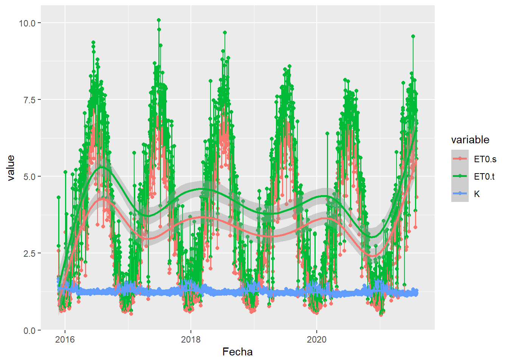

```{r setup, include=FALSE}
knitr::opts_chunk$set(error = TRUE)
knitr::opts_chunk$set(cache = TRUE)
```

# Configuración

```{r}
source(file.path("code","include.R"), encoding = "UTF-8")
dirs$data <- "datosTFG"
dflt$ini <- as.Date("2019-01-01")
dflt$fin <- as.Date("2021-05-17")
```


# Introducción

Usamos 2 servidores. Uno principal (`juno`) y otro para los datos de riego (`dibulibu`).
Veamos lo que hay en `juno`:

```{r}
s <- Verdor$conectarServVerdor()
status <- ssh::ssh_exec_wait(s, "ls RiegoInteligente")
```

Tenemos ficheros de datos (`datos`) y de código (`code`).
Además...

+ `hw.sh`: devuelve un listado de características del servidor
+ `disco.sh`: para ver el espacio de disco ocupado
+ `colorRamps`, `paramsTS` contienen parámetros de algunos plots.

```{r}
status <- ssh::ssh_exec_wait(s, "ls RiegoInteligente/datos")
status <- ssh::ssh_exec_wait(s, "ls RiegoInteligente/datos/geo")
status <- ssh::ssh_exec_wait(s, "ls RiegoInteligente/datos/amb")
status <- ssh::ssh_exec_wait(s, "ls RiegoInteligente/datos/riego")
status <- ssh::ssh_exec_wait(s, "ls RiegoInteligente/datos/verdor")
```

**Los `datos` tienen la estructura descrita en `README.Rmd`**.

```{r}
status <- ssh::ssh_exec_wait(s, "ls RiegoInteligente/code")
ssh::ssh_disconnect(s)
```

**Lo mismo podemos decir de `code`**.

Por otro lado, en `dibulibu`, está todo lo relacionado con los datos de riego pero también los datos geográficos de jardines, ya que se necesitan los id de los contratos y las áreas de las zonas verdes:

```{r}
sr <- Riego$conectarServRiego()
status <- ssh::ssh_exec_wait(sr, "ls RiegoInteligente")
status <- ssh::ssh_exec_wait(sr, "ls RiegoInteligente/datos")
status <- ssh::ssh_exec_wait(sr, "ls RiegoInteligente/datos/geo")
status <- ssh::ssh_exec_wait(sr, "ls RiegoInteligente/datos/riego")
status <- ssh::ssh_exec_wait(sr, "ls RiegoInteligente/code")
ssh::ssh_disconnect(sr)
```


# Datos geográficos (`DatGeo.R`)


## Datos geográficos de estaciones meteorológicas

[Aquí](https://datosabiertos.regiondemurcia.es/carm/catalogo/medio-ambiente/estaciones-meteorologicas-de-la-red-siam-carm>),
es de donde se descargó un CSV (`paths$geo("estaciones")`) con las ubicaciones de las estaciones meteorológicas.

> **¡IMPORTANTE!** La variable `dflt$eemm` es la que guarda los identificadores de las estaciones que se tienen en cuenta.
Si se consiguen datos de más estaciones hay que modificarla para que se tengan en cuenta.
Además, hay que asegurarse de que se disponen de los datos de ubicación de dichas estaciones (función `DatGeo$leerEstMet`).

```{r fichero4.1_getDE}
dflt$eemm
paths$geo("estaciones")
de <- DatGeo$leerEstMet(dflt$eemm)
str(de)
```


## Datos geográficos de jardines


### Fichero 2: Ubicaciones de los parques


#### Fichero 2.2: Contornos de las zonas verdes `zonasVerdesAP.shp` (el importante)

```{r fichero2.2_get}
paths$geo("zonas")
zonasTodas <- DatGeo$leerZonasVerdes()
```

+ Este fichero contiene varios datos de `r nrow(zonasTodas)` zonas verdes de agua potable asociadas a `r dplyr::n_distinct(zonasTodas$Acometida)` acometidas,
como el número de polígonos (`Poligonos`), el área (`Area`), el perímetro (`Perimetro`), etc.
+ **El identificador de las acometidas se ha renombrado de `CAPA_CAD` a `Acometida`**.
El identificador señalado NO es una clave primaria (hay acometidas con varias zonas verdes).

```{r fichero2.2_str}
str(zonasTodas)
```

Resumimos el fichero anterior, guardando, para cada acometida:

+ su identificador (`Acometida`),
+ el número de zonas verdes (`ZonasVerdes`),
+ el número total de polígonos (`Poligonos`),
+ el área total (`Area`),
+ el área del polígono más grande (`MasGrande`),
+ el área del polígono más pequeño (`MasPeque`),
+ el perímetro total (`Perimetro`),
+ el perímetro del polígono más largo (`MasLargo`),
+ el perímetro del polígono más corto (`MasCorto`).

```{r fichero2.2_getResumen}
paths$geo("zonasR")
zonas <- DatGeo$leerResumenZonasVerdes()
str(zonas)
```

```{r fichero2.2_count, eval=FALSE, include=FALSE}
zonasTodas %>% sf::st_drop_geometry() %>%
  dplyr::count(Poligonos, name = "Numero de zonas verdes")
zonas %>% sf::st_drop_geometry() %>%
  dplyr::count(ZonasVerdes, name = "Numero de acometidas (parques)")
zonas %>% sf::st_drop_geometry() %>%
  dplyr::count(Poligonos, name = "Numero de acometidas (parques)")
```


#### Fichero 2.1: Coordenadas de las acometidas `Acometidas.csv`

Una acometida se define como la instalación comprendida
entre la tubería de la red de distribución (donde hay una válvula)
y la instalación interior del edificio (la batería de contadores).

```{r fichero2.1_get}
paths$geo("acometidas")
acometidas <- DatGeo$leerAcometidas(acometidas = zonas$Acometida)
```

+ Este fichero contiene varios datos asociados a `r nrow(acometidas)` acometidas de contratos, como el diámetro, la longitud, la profundidad, etc.
+ **El identificador de las acometidas se ha renombrado de `AC_ID` a `Acometida`**.
+ Nos dan datos de ubicación precisos: las coordenadas UTM de las acometidas (`Abcisa`, `Norte`).

> Vemos que hay `r nrow(acometidas)` acometidas, frente a las `r nrow(zonas)` que había en `zonas`,
**por lo que desconocemos la ubicación exacta de `r nrow(zonas)-nrow(acometidas)` acometidas.**

```{r fichero2.1_str}
str(acometidas)
```


### Fichero 1: Contratos de agua de parques y jardines

Tenemos varias versiones de este fichero.


#### Fichero 1.2: última versión `Contratos de alta en AQUACIS parques y jardines.xlsx` (el importante)

```{r fichero1.2_get}
paths$geo("relaciones")
relaciones <- DatGeo$leerRelaciones(acometidas = zonas$Acometida)
```

+ Este fichero contiene `r nrow(relaciones)` contratos de abastecimiento de agua con EMUASA
  por parte del ayuntamiento de Murcia, principalmente.
+ **Cada contrato tiene un identificador único (`Contrato`)**.
+ El contrato depende del tipo de instalación (parque, jardín, ...) sobre la que se hace (`Agrupacion`)
y de para qué se usa en particular el punto de servicio (`TipoPuntoServicios`).
+ **El consumo es medido por contadores, que tienen un identificador (`Contador`)**.
También contiene otros datos del contador:
el calibre (`Calibre`), el modelo (`ModeloContador`), el tipo (`TipoContador`), cuándo se instaló (`FechaInstContador`), además de **si funciona con un sistema de telelectura (`Telectura`)**.
+ **En este caso, además del identificador del contrato, aparece el de la acometida (`Acometida`)**.
+ También nos dan más datos de ubicación (`Direccion`, `ComplementoDireccion`, `Localidad`, `Barrio`).

**Lo interesante de esta tabla es que relaciona un parque (`Contrato`) con la acometida (`Acometida`) y el contador (`Contador`)**.
La acometida NO es una clave primaria, pues hay 1 acometida que tiene asociada 2 contratos (**dejamos de tener en cuenta este parque, ya no aparece**),
tampoco lo es el contador, pues un contrato no tiene, pero el contrato sí que es clave primaria.

> Vemos que hay `r dplyr::n_distinct(relaciones$Acometida)` acometidas, frente a las `r nrow(zonas)` que había en `zonas`,
**por lo que desconocemos el contrato de `r nrow(zonas)`-`r dplyr::n_distinct(relaciones$Acometida)`=`r nrow(zonas)-dplyr::n_distinct(relaciones$Acometida)` acometidas.**

```{r fichero1.2_str}
str(relaciones)
```


#### Fichero 1.1: primera versión `CONTRATOS_AGUA_PARQUES_Y_JARDINES.csv`

```{r fichero1.1_get}
paths$geo("contratos")
contratos <- DatGeo$leerContratos(contratos = relaciones$Contrato)
```

+ Este fichero contiene `r nrow(contratos)` contratos de abastecimiento de agua con EMUASA
  por parte del ayuntamiento de Murcia, principalmente.
+ **Cada contrato tiene un identificador único (`Contrato`)**, que es clave primaria.
+ El contrato depende del tipo de instalación (parque, jardín, ...) sobre la que se hace (`TipoContrato`).
<!-- + Además, la tabla contiene información sobre la ubicación de la instalación sobre la que se hace el contrato (`Localidad`, `Direccion` y `ComplDireccion`). -->

> Vemos que están todos los contratos de `relaciones` que nos interesan.

```{r fichero1.1_str}
str(contratos)
```


### Tarea 1. Reuniendo todos los datos geográficos.


#### Tarea 1.1. Qué zona riega cada contador.

Juntamos todas las tablas anteriores en una.
<!-- Las direcciones  tienen una indicación final que casi siempre empieza por `SN` (o ...). -->
<!-- Dejamos en `Direccion` la propia dirección y separamos la indicación final en otra variable, `Indicacion`. -->

```{r tarea1.1_reunir}
dg <- DatGeo$reunirTablas()
str(dg)
```


#### Tarea 1.2. Qué estación meteorológica está más cerca de cada jardín.

Añadimos la `Distancia` en $m$ a la estación meteorológica más cercana (`Principal`) de la cual extraer las variables ambientales del parque.
Además guardamos los identificadores de las otras estaciones para cada jardín, en orden por cercanía (`AlternativaX`, `X`=1,...,4).

```{r tarea1.2_asignar}
# dg <- DatGeo$asignarEstMet(dg)
dg <- DatGeo$asignarEstMet(dg %>% dplyr::select())
str(dg, max.level = 1)
```


#### Tarea 1.3. En qué mosaico está cada jardín.

Por último, obtenemos los identificadores de los mosaicos para Sentinel-2 en los que está contenido cada jardín (`Mosaico`, `Moisaico2`).
Si sólo está en 1 ambos campos coinciden.
Además contiene el mínimo número de mosaicos que hace falta para cubrirlo (`MinMosaicos`) y el número de mosaicos con los que interseca (`MaxMosaicos`).
Vemos que:

  - todas las zonas están completamente contenidas (al menos) en un sólo mosaico;
  - la mayoría (337 / 363 = 92.84 %) están completamente contenidos en un sólo mosaico,
  mientras que unos pocos (26 / 363 = 7.16 %) están en la intersección de ambos mosaicos.

```{r tarea1.3_asignar}
# system.time( dg <- DatGeo$asignarMosSen2(dg) )
system.time( dg <- DatGeo$asignarMosSen2(dg %>% dplyr::select()) )
str(dg, max.level = 1)
dg %>% sf::st_drop_geometry() %>%
  dplyr::count(MinMosaicos, MaxMosaicos, Mosaico, Mosaico2, name = "Numero de parques")
```


#### Todos los pasos juntos (los métodos finales)

> **El método principal es `DatGeo$initJardines()`.
Además de generar el fichero con los datos geográficos de todos los jardines juntos, los guarda en una carpeta, un fichero para cada parque, para la descarga de imágenes de Sentinel-2.**

```{r tarea1_set, eval=FALSE}
DatGeo$initJardines()
```

```{r tarea1_get}
dg <- DatGeo$leerJardines()
str(dg, max.level = 1)
```


### Tarea 6.1.1. Dibujando simple features (`sf`)

Algunos ejemplos ilustrativos:

```{r tarea6.1.1_plotPoligonos}
DatGeo$plotMapa(obj_sf=dg, group_var=NULL,
                color = "red", fillColor = "red")
DatGeo$plotMapa(obj_sf=dg, group_var=NULL,
                plot_var="Principal")
DatGeo$plotMapa(obj_sf=dg %>% dplyr::mutate(Distancia = Distancia / 1000),
                group_var=NULL,
                plot_var="Distancia",
                n = 5L)
DatGeo$plotMapa(obj_sf=dg, group_var="Barrio",
                filter_var="Localidad",
                filter_values=c("LA ALBERCA","SANTO ANGEL"),
                plot_var="Poligonos")
DatGeo$plotMapa(obj_sf=dg, group_var="Contrato",
                filter_var="Localidad",
                filter_values="LOBOSILLO",
                plot_var="Contrato",
                color = "black")
DatGeo$plotMapa(obj_sf=dg, group_var="Contrato",
                filter_var="Contrato",
                filter_values="6373577")
```
```{r tarea6.1.1_plotPuntos}
dgp <- sf::st_centroid(dg)

DatGeo$plotMapa(obj_sf=dgp, group_var=NULL)
DatGeo$plotMapa(obj_sf=dgp, group_var=NULL,
                cluster = F)
DatGeo$plotMapa(obj_sf=dgp, group_var=NULL,
                plot_var="Principal")
DatGeo$plotMapa(obj_sf=dgp %>% dplyr::mutate(Distancia = Distancia / 1000),
                group_var=NULL,
                plot_var="Distancia",
                n = 5,
                r = 5,
                cluster = F)

de <- DatGeo$leerEstMet() %>%
  sf::st_as_sf(coords = c("LONGITUD", "LATITUD"), crs = DatGeo$epsg$etrs89geo)
DatGeo$plotMapa(obj_sf=de, group_var=NULL)
```

> Para guardar indicar un `nombre_fichero`:

```{r tarea6.1.1_guardar}
# webshot::install_phantomjs()
m <- DatGeo$plotMapa(dg,"Contrato","Contrato","6373577",
                     nombre_fichero = "MapaCWorld")
m <- DatGeo$plotMapa(dg,"Contrato","Contrato","6373577",
                     nombre_fichero = "MapaCWorldCtrl", remove_controls = F)

m <- DatGeo$plotMapa(dg,"Contrato", width = 1050, height = 750,
                     nombre_fichero = "MapaWorld")
m <- DatGeo$plotMapa(dg,"Contrato", width = 1050, height = 750,
                     nombre_fichero = "MapaWorldCtrl", remove_controls = F)
```


### Tarea 6.2. Visualización de datos (tablas e histogramas)

Para guardar indicar un `f_save`:

```{r tarea6.2.1_f_save}
ply <- F
dflt$lan
# dflt$lan <- "sp"
f_save <- "png"
# f_save <- NULL
```

```{r tarea6.2.1_Poligonos}
val <- 50; x_lab <- switch(dflt$lan,
  "sp" = "Número de polígonos",
  "en" = "Number of polygons"
)
DatInt$plotHist(dg, Poligonos, x_lab, sup = val,
                f_save = f_save, ply = ply)
# DatInt$plotHist(dg, Poligonos, x_lab, inf = val,
#                 f_save = f_save, ply = ply)
# gridExtra::grid.arrange(p1, p2, ncol=2)
DatInt$plotHist(dg, Poligonos, x_lab,
                f_save = f_save, ply = ply)

n = dg %>% dplyr::filter(Poligonos == 1) %>% nrow()
N = dg %>% nrow()
msg(n," / ",N," = ",redondea2(n/N*100)," % (Poligonos = 1)")
```

```{r tarea6.2.1_Area}
val <- 12000; x_lab <- switch(dflt$lan,
  "sp" = latex2exp::TeX("Área total del parque ($m^2$)"),
  "en" = latex2exp::TeX("Total garden area ($m^2$)")
)
DatInt$plotHist(dg, Area, x_lab, sup = val,
                f_save = f_save, ply = ply)
DatInt$plotHist(dg, Area, x_lab,
                f_save = f_save, ply = ply)
```

```{r tarea6.2.1_Distancia}
val <- 10; x_lab <- switch(dflt$lan,
  "sp" = latex2exp::TeX("Distancia del parque a su estación principal ($km$)"),
  "en" = latex2exp::TeX("Distance from the garden to your main station ($km$)")
)
DatInt$plotHist(dg %>% dplyr::mutate(Distancia = Distancia/1000), Distancia,
                x_lab, f_save = f_save, ply = ply)
```

```{r tarea6.2.1_estaciones}
DatGeo$consultarDatGeo("tablaEstMet", dg = dg)
escribirTablaLatex(DatGeo$consultarDatGeo("tablaEstMet", dg = dg), "estaciones")
```

```{r tarea6.2.1_estaciones2}
DatGeo$consultarDatGeo("tablaEstMet2", dg = dg)
escribirTablaLatex(DatGeo$consultarDatGeo("tablaEstMet2", dg = dg), "estaciones2")
```

```{r tarea6.2.1_mosaicos}
t(DatGeo$consultarDatGeo("tablaMosSen2", dg = dg))
escribirTablaLatex(t(DatGeo$consultarDatGeo("tablaMosSen2", dg = dg)), "mosaicos")
```


# Datos ambientales (`DatAmb.R`)


## Fichero 4: Datos meteorológicos

```{r fichero4.1_completar, include=FALSE}
sapply(dflt$eemm, DatAmb$completarDatMet)
```

### Indicaciones

>te paso el acceso a algunos datos del IMIDA que se llevan recogiendo desde 2015.
Son 4 estaciones meteorológicas, cuya ubicación exacta se puede comprobar aquí: 
<https://datosabiertos.regiondemurcia.es/carm/catalogo/medio-ambiente/estaciones-meteorologicas-de-la-red-siam-carm>

+ MO12: Las Torres de Cotillas
+ MU62: Murcia
+ CA91: Fuente ÁLamo
+ CA42: Fuente Álamo.
 
>El acceso: <ftp://idei.imida.es/>

    Usario: um
    Contraseña: ImidA_Siam2

>Si fuera necesario o interesante creo que se podrían obtener los datos de cualquier estación.

>Las variables son bastante intuitivas creo, te paso las que pueden no entenderse:

+ radmed: radiación media
+ radmax: radiación máxima
+ vvmed: velocidad del viento media
+ vvmax: velocidad del viento máxima
+ dvmed: dirección del viento media
+ prec: precipitaciones
+ dewpt: dew point (punto de rocio)
+ dpv: déficit de presión del vapor.

>Por ahora no tenemos más estaciones meteorológicas, por lo que igual hay que coger 1 (o 2) para todos los parques.
Digo 2 porque a veces habrán datos malos en una u otra.

### Credenciales y valores por defecto

```{r fichero4.1_cred}
DatAmb$url
DatAmb$userpwd
```

> **¡IMPORTANTE!** Si se consiguen datos de más estaciones comprobar que realmente están accesibles (función `DatAmb$consultarEstMet`).

```{r fichero4.1_dflt}
estaciones <- DatAmb$consultarEstMet()
estaciones
dflt$eemm
```

### Descarga y preprocesamiento

> El método principal es `DatAmb$initDatMet()`,
que se apoya en `DatAmb$downloadDatMet()` y `DatAmb$completarDatMet()`.

```{r fichero4.1_set, eval=FALSE}
DatAmb$initDatMet()
```

> **¡IMPORTANTE!** En `DatAmb$completarDatMet` se van completando las variables hasta que no faltan valores para `DatAmb$vars`, que son las que se utilizan para calcular la $ET_0$.
>
> Cuando actualizamos los datos realmente no se "actualizan", se "machacan" los anteriores (`init` vs `update`).
> Además, se utiliza un único modelo por variable y pareja de estaciones.
> Todo ello puede resultar en un problema de **reproducibilidad de resultados**, ya que entre una actualización y la siguiente los modelos serán parecidos pero no idénticos, por lo que los valores por los que se sustituyan los NAs tampoco serán iguales.
>
> NO SERIA MUY DIFICIL CAMBIAR ESTO:
>
>  1. Para "actualizar":
>
>    + En `DatAmb$completarDatMet` al principio se leen los ficheros de cada estación.
Cambiarlo para que el primero sea la "última versión" (utilizar `DatAm$leerDatMet`) añadiéndole los nuevos datos.
>    + ¡Cambiar cómo se obtiene el nombre del fichero resultante! Observar variable `k` del bucle de `DatAmb$completarDatMet` (puede que las nuevas observaciones no tengan datos NA...)
>    + Escribir `DatAmb$updateDatMet` a partir de `DatAmb$initDatMet` quitando la primera línea que borra todos los ficheros y la comprobación `if (is.null(fichero))`.
>
>  2. Para conseguir reproducibilidad de resultados:
>
>    + En la función `na.replace` de `DatAmb$completarDatMet` iterar sobre los valores a predecir (cuyos índices son `idx_pred`) obteniendo un modelo lineal a partir de sólo los datos anteriores (posicionces menores de índices de `idx_train`).
>
> Realmente lo importante es hacer lo segundo, no lo primero. Sin embargo, aunque ahora no se tarde demasiado en completar los datos, si sólo hacemos el segundo punto sí que puede que vaya a empezar a ser un poco lento...


### Leyendo los ficheros

Para leer los datos de una estación:

```{r fichero4.1_get}
dm <- DatAmb$leerDatMet("MU21")
str(dm)
```

El parámetro `estacion` de `DatAmb$leerDatMet` puede ser identificador o un vector de ids, donde el primer elemento es la estacion principal y el resto las alternativas.

Para leer los datos de varias estaciones:

```{r fichero4.1_read}
dms <- DatAmb$readDatMet(list("MU21", c("MU21", "MU62")))
str(dms, max.level = 1)
sapply(dms, function(dm) sum(!stats::complete.cases(dm)))
sapply(dms, function(dm) sapply(dm, numNA))
```

El parámetro `estaciones` de `DatAmb$readDatMet` debe ser una lista del tipo `estacion`.

```{r fichero4.1_read1, eval=FALSE, include=FALSE}
dms <- DatAmb$readDatMet(list(dflt$eemm[5:3],dflt$eemm[1:3]))
str(dms, max.level = 1)
```
```{r fichero4.1_read2, eval=FALSE, include=FALSE}
dms <- DatAmb$readDatMet(dflt$eemm)
str(dms, max.level = 1)
sapply(dms, function(dm) sum(!stats::complete.cases(dm)))
sapply(dms, function(dm) sapply(dm, numNA))
```
```{r fichero4.1_listDF2DF2, eval=FALSE, include=FALSE}
dms <- listDF2DF(dms, "Estacion")
str(dms)
```
```{r fichero4.1_dflt_dm, eval=FALSE, include=FALSE}
dms <- dflt$dms()
str(dms)
```

### Visualizando los modelos de regresión lineal

Para guardar indicar un `f_save`:

```{r tarea4.1_f_save}
f_save <- "svg"
f_save <- "png"
# f_save <- NULL
```

```{r fichero4.1_plot}
DatAmb$plotModelDatMet(princ = "CA42", alter = "CA91", vr = "HRmed",
                       fin = "2021-05-15", f_save = f_save)
DatAmb$plotModelDatMet(princ = c("CA42","CA91"), alter = "MU62", vr = "HRmed",
                       fin = "2021-05-15", f_save = f_save)
```

### Tarea 6.2. Visualización de datos (tablas e histogramas)

```{r tarea6.2.2_datMet}
DatAmb$consultarDatMet("tablaNA")
```


## Paquete `ET.PenmanMonteith`

### Valores por defecto

> **¡IMPORTANTE!** La variable `dflt$crops` contiene los posibles valores de `dflt$crop`.
En teoría da igual cuál elijamos, pues la diferencia es una constante.
Comprobado experimentalmente para MU62.

```{r fichero4.2_dflt}
dflt$crops
dflt$crop
```



### Preprocesamiento

Para instalar un paquete desde github:

```{r fichero4.2_install, eval=FALSE}
devtools::install_github("VicenteYago/ET.PenmanMonteith")
```

> El método principal es `DatAmb$initET0()`,
que se apoya en `DatAmb$calcularET0()` que a su vez llama a `ET.PenmanMonteith::et0()`.

```{r fichero4.2_set, eval=FALSE}
DatAmb$initET0()
```

> **IMPORTANTE** De nuevo, cuando actualizamos los datos realmente no se "actualizan", se "machacan" los anteriores (`init` vs `update`). De nuevo, esto no sería muy difícil de cambiar... siempre y cuando `ET.PenmanMonteith::et0()` devuelva lo mismo (ver `testET0.zip`)

### Leyendo uno de los ficheros

```{r fichero4.2_get}
et0 <- DatAmb$leerET0(c("MU21","MU62"), "tall")
str(et0)
```

```{r fichero4.2_read, eval=FALSE, include=FALSE}
et0s <- DatAmb$readET0(list("MU62", c("MU21","MU62")), "tall")
str(et0s, max.level = 1)
```
```{r fichero4.2_listDF2DF, eval=FALSE, include=FALSE}
system.time( et0s <- listDF2DF(et0s, "Estacion") )
str(et0s)
```


## Juntando todos los datos ambientales

**Finalmente, los datos meteorológicos se agregan mediante el método estadístico correspondiente y se juntan con los valores de evapotranspiración de referencia** (nada de esto se almacena, sino que se obtiene directamente).

```{r fichero4.3_get}
da <- DatAmb$leerDatAmb("MU62", "tall")
str(da)
# summary(da)
```

```{r fichero4.3_read, eval=FALSE, include=FALSE}
das <- DatAmb$readDatAmb(list("MU62", c("MU21","MU62")), "tall")
str(das, max.level = 1)
```
```{r fichero4.3_listDF2DF, eval=FALSE, include=FALSE}
das <- listDF2DF(das, "Estacion")
str(das)
```
```{r fichero4.3_dflt_da, eval=FALSE, include=FALSE}
das <- dflt$das()
str(das)
```


# Datos de riego (`Riego.R`)

> **¡IMPORTANTE!** El procesamiento de los datos de riego en `run.R` depende del servidor (`dibulibu` hace `update` y `juno` hace `download`).
En vez de descargar los datos de `dibulibu` desde `juno` lo suyo sería pasar los ficheros de lecturas comprimidas y hacer todo en `juno`.
Para ello, pasar los datos de la carpeta `agua` del servidor `dibulibu` al servidor `juno` en `RiegoInteligente/datos/riego/agua`, mediante `rsync`. Para cambiar el procesamiento de los datos de `riego` a `juno` cambiar `Riego$nodename` de `"dibulibu"` a `"juno"` y las credenciales `Riego$host` y `Riego$pwd`).

Hay días que no hay ficheros ZIP, pero se podrían obtener (ver CORREO Re: Posible entrevista con experto para dudas del TFG de Pedro J. Fernández Ruiz):

```{r fichero3.0_consultar}
Riego$consultarFilesAgua("fechasFalt")
```

## Fichero 3: Lecturas

### Indicaciones

> Todos los zip que tenemos se encuentran accesibles en un repositorio al que puedes acceder por `ssh`, yo hago en la terminal lo siguiente:

    ssh aurora@155.54.204.34

> y la contraseña es:

    aauroralegustaelagua

> Los ficheros se encentran en la carpeta "agua" y no te recomiendo que te los descargues todos, sino que cuando consigas simplifciar o agregar uno, hagamos una llamada a cada uno de esos zip pero sin descargarlos.

> Esto sirve para ver qué fechas tenemos monitorizadas (para ver qué imágenes necesitamos y demás)

### Credenciales

```{r fichero3.1_cred}
Riego$nodename
Riego$host
Riego$pwd
```

### Descarga o preprocesamiento

> En el servidor `dibulibu` se ejecuta `Riego$updateLecturas()`, que se apoya en `Riego$extraerLecturas()`.

> Para ejecutar localmente basta llamar a `Riego$downloadLecturas()`, que es lo que hace `juno`.

```{r fichero3.1_set, eval=FALSE}
Riego$downloadLecturas()
```

> **¡IMPORTANTE!** Cuando actualizamos los datos de **lecturas**  sí que se "actualizan" (gracias al fichero `paths$proc()`). Para "resetear" borrar dicho fichero y la carpeta `paths$lects()`.

### Leyendo uno de los ficheros

+ Los ficheros "lecturas/\<contrato\>.csv" contienen las lecturas del/de los contador/es del parque asociado a \<contrato\>.
+ El identificador del contador es `Contador`.
+ **La fecha y hora a la que se ha hecho una telelectura es `Fecha`**.
+ **La telelectura del contador es `Lectura`**. La unidad es el *litro*.
+ Adicionalmente se añaden variables que indican
  * si de una telelectura a la siguiente se produce un cambio de contador (`CambiaContador`),
  * el tiempo que pasa (`Tiempo`) y caúl sería el consumo (`Consumo`) entre una lectura y la siguiente.

**Las muestras no están tomadas uniformemente**.
**Tenemos datos desde el 29 de septiembre de 2017 hasta la actualidad**, en general.

```{r fichero3.1_get}
lectura <- Riego$leerLecturas("6397830", debug = T)
str(lectura)
```

> **¡IMPORTANTE!** a veces hay varias lecturas para un mismo instante.
> Si son iguales no pasa nada, se descartan indicándolo con un mensaje (`debug = T`).
> Cuando no son iguales parece que el contador se queda colgado y lo que hace es alternar entre dos valores durante varias tomas así que también se descartan y se notifica (`debug = T`).
> Con `Riego$cleanLecturas()` podemos eliminar de los ficheros las lecturas duplicadas (`rmDup`),
las lecturas erróneas (`rmErr`) y quitar lecturas redundantes que no afectan al cálculo de los consumos (`rmRed`).


```{r fichero3.1_read, eval=FALSE, include=FALSE}
system.time( lecturas <- Riego$readLecturas(NULL, T, debug = T) )
length(lecturas)
str(lecturas[1:10], max.level = 1)
```
```{r fichero3.1_listDF2DF, eval=FALSE, include=FALSE}
lecturas <- listDF2DF(lecturas, "Contrato")
str(lecturas)
```
```{r fichero3.1_dflt_lects, eval=FALSE, include=FALSE}
system.time( lecturas <- dflt$lecturas() )
str(lecturas)
```

### Algunas consultas (sobre resúmenes estadísticos)

#### Problema: Contratos que no tienen lecturas, tienen varios contadores o con contadores distintos en `dg` y en `lecturas`

Guardamos, para cada contrato, si no tiene, tiene uno, ninguno o varios contadores en `lect`.
**Los que no tienen ningún contador en son los que no tienen lecturas.**
Los que tienen varios es porque se lo han cambiado (no tiene varios simultáneamente).
También guardamos, para los que tienen al menos uno en si es igual, casi igual o distinto al que hay en `dg` (si tiene varios nos fijamos en el último).

```{r fichero3.1_resumenCont_get}
contadoresR <- Riego$leerResumenContadores()
# str(contadoresR)
```
```{r fichero3.1_resumenCont_sinLecturas}
Riego$consultarResumenContadores("sinLecturas", contadoresR) %>% nrow()
```
```{r fichero3.1_resumenCont_variosContadores}
Riego$consultarResumenContadores("variosContadores", contadoresR) %>% nrow()
```

Es importante observar que a la hora de calcular los consumos tendremos que tener en cuenta cuándo se cambian los contadores.

#### ¿Con qué frecuencia y desde cuándo tenemos datos?

Para los contratos que tenemos lecturas hemos generado una tabla que guarda para cada contrato desde y hasta cuando tienen datos y un resumen sobre la frecuencia *cuando hay consumo* de las lecturas, **porque será cuando realmente sesguemos los datos al calcular los consumos diarios**.

```{r fichero3.1_resumenLect_get}
lecturasR <- Riego$leerResumenLecturas()
# str(lecturasR)
```

```{r fichero3.1_resumenLect_tardias}
# La mayoría (todos menos 62) de los contratos con lecturas recogen estos datos con telelectura desde el 29/09/2017
Riego$consultarResumenLecturas("tardias", "2017-09-30", res = lecturasR) %>% nrow()
# Hay 12 contratos de los que empezamos a tener lecturas un poco tarde (después de `dflt$tardias`)
dflt$tardias
Riego$consultarResumenLecturas("tardias", res = lecturasR) %>% nrow()
```

La mayoría sigue recogiendo los datos hasta a día de hoy.

```{r fichero3.1_resumenLect_noActuales}
# Hay 17 contratos de los que no tenemos lecturas a día de hoy (hasta `dflt$noActuales`)
dflt$noActuales
Riego$consultarResumenLecturas("noActuales", res = lecturasR) %>% nrow()
```

Muchos de los contratos están como mucho 9 días sin telelectura en los periodos donde se registra un cambio de consumo.

```{r fichero3.1_resumenLect_faltantes}
# Hay 59 contratos de los que nos faltan muchas lecturas en un largo periodo de tiempo (`dflt$faltantesL`)
dflt$faltantesL
Riego$consultarResumenLecturas("faltantes", res = lecturasR) %>% nrow()
```

#### Problema: Consumos negativos (reseteo, retorno o avería)

¿Cómo proceden cuando un contador alcanza la lectura máxima?

> Cuando llega al máximo el contador mecánico empieza de nuevo por 0, en telelectura el contador no tiene el mismo límite por lo que se añade un dígito más, un contador de vueltas, los contadores que han dado la vuelta en facturación se ven con este dígito más que no tiene el contador mecánico, lo que no influye en la facturación ya que esta es a diferencias.

¿Por qué aparecen consumos de agua negativos, es decir, dos lecturas sucesivas de un mismo contador en las que la primera lectura es mayor que la siguiente?

> Los consumos negativos aparecen por retornos en la red, por una avería en la válvula antirretorno el agua puede circular en poca cantidad en sentido inverso, debido a la diferencia de presiones. Pocos casos se han debido a avería del módulo de comunicaciones y se ha resuelto con el cambio del módulo. Otros casos de negativos se nos dan en contadores que se encuentran en los límites de sectores y el agua circula de forma habitual en ambos sentidos.

> **IMPORTANTE** Cuando calculemos el consumo diario puede que muchas cantidades pequeñas negativas desaparezcan, pero no las grandes...

```{r fichero3.1_resumenLect_negativo}
# Hay 126 contratos con consumos negativos
Riego$consultarResumenLecturas("negativo", res = lecturasR) %>% nrow()
```


### Tarea 6.2. Visualización de datos (tablas e histogramas)

```{r tarea6.2.3_resumenCont}
contadoresR <- Riego$leerResumenContadores()
Riego$consultarResumenContadores("tabla", contadoresR)
```

Para guardar indicar un `f_save`:

```{r tarea6.2.3_f_save}
ply <- F
dflt$lan
# dflt$lan <- "sp"
f_save <- "svg"
f_save <- "png"
# f_save <- NULL
```

```{r tarea6.2.3_lecturasR}
lecturasR <- Riego$leerResumenLecturas() %>%
  dplyr::mutate_at(dplyr::vars(contains("Tiempo_")), lubridate::period_to_seconds) %>%
  dplyr::mutate_at(dplyr::vars(contains("Tiempo_")), as.difftime, units = "secs")
units(lecturasR$Tiempo_Min) <- "mins"
units(lecturasR$Tiempo_Mean) <- "hours"
units(lecturasR$Tiempo_Max) <- "days"
lecturasR %<>%
  dplyr::mutate_at(dplyr::vars(contains("Tiempo_")), as.double) %>%
  dplyr::mutate_at(dplyr::vars(contains("Tiempo_")), round, 2)
```

```{r tarea6.2.3_Fecha_Min}
val <- as.Date("2017-09-30"); x_lab <- switch(dflt$lan,
  "sp" = "primera telelectura",
  "en" = "first remote reading"
)
DatInt$plotHist(lecturasR, Fecha_Min, x_lab, .bw = "month", inf = val,
                f_save = f_save, ply = ply)
DatInt$plotHist(lecturasR, Fecha_Min, x_lab, .bw = "quarter",
                f_save = f_save, ply = ply)
```
```{r tarea6.2.3_Fecha_Max}
val <- as.Date("2021-05-01"); x_lab <- switch(dflt$lan,
  "sp" = "última telelectura",
  "en" = "last remote reading"
)
DatInt$plotHist(lecturasR, Fecha_Max, x_lab, .bw = "month", sup = val,
                f_save = f_save, ply = ply)
DatInt$plotHist(lecturasR, Fecha_Max, x_lab, .bw = "quarter",
                f_save = f_save, ply = ply)
```

```{r tarea6.2.3_Tiempo_Max}
val <- 450; x_lab <- switch(dflt$lan,
  "sp" = "Longitud de intervalo de tiempo más largo con consumo pero sin lecturas (días)",
  "en" = "Length of longest time interval with consumption but without readings (days)"
)
DatInt$plotHist(lecturasR, Tiempo_Max, x_lab, .bw = "largo", sup = val,
                f_save = f_save, ply = ply)
```


## Consumos

### Descarga o preprocesamiento

> En el servidor `dibulibu` se ejecuta `Riego$initConsumos()`, que se apoya en `Riego$calcularConsumos()` y éste a su vez en `Riego$deLecturasAConsumos()`

> Para ejecutar localmente podemos llamar a `Riego$downloadConsumos()`, que es lo que hace `juno` (o si hemos descargado las lecturas `Riego$initConsumos()`).

```{r fichero3.2_set, eval=FALSE}
Riego$downloadConsumos()
```

> **¡IMPORTANTE!** De nuevo, los **consumos** realmente no se "actualizan", se "machacan" los anteriores (`init` vs `update`).

> EN ESTE CASO CAMBIAR ESTE COMPORTAMIENTO PUEDE SER UN POCO MÁS COMPLICADO ya que hay que tener una lectura anterior y otra posterior al día, por lo que no podemos guardar el consumo de un día hasta que no tengamos una lectura del día siguiente... y todo depende del supuesto de que los datos de los ficheros ZIP vengan ordenados.
No obstante, hay un intento de ello (`Riego$updateConsumos()` => `Riego$calcularConsumos2() => Riego$deLecturasAConsumosPeriodo()`).

> **¡IMPORTANTE!** Hay dos versiones para calcular los consumos.
>
>  + Versión 1: los consumos diarios entre cambios de contadores se establecen `NA`.
>  + Versión 2 (por defecto): en este caso se calculan como se explica en el TFG.

### Leyendo uno de los ficheros

+ Los ficheros "consumos/\<contrato\>.csv" contienen los consumos DIARIOS totales (`ConsumoTotal`) y por $m^2$ (`Consumo`) del parque asociado a \<contrato\>.
+ La unidad es la misma que las lecturas ($L$ o $L/m^2$).

```{r fichero3.2_get}
consumo <- Riego$leerConsumos("6351960")
str(consumo)
```

```{r fichero3.2_read, eval=FALSE, include=FALSE}
consumos <- Riego$readConsumos(NULL)
length(consumos)
str(consumos[1:3], max.level = 1)
```
```{r fichero3.2_listDF2DF, eval=FALSE, include=FALSE}
consumos <- listDF2DF(consumos, "Contrato")
str(consumos)
```
```{r fichero3.2_dflt_conss, eval=FALSE, include=FALSE}
consumos <- dflt$consumos()
str(consumos)
```

### Algunas consultas (sobre resúmenes estadísticos)

#### Problema: Cambio de contadores (version 1) y consumos negativos

```{r fichero3.2/getResumen}
consumosR <- Riego$leerResumenConsumos()
# str(consumosR)
```

```{r fichero3.2/consumo_totalNA}
# Hay 52 contratos (de los 75 que cambian de contador) que nos faltan datos de consumo
Riego$consultarResumenConsumos("faltantes", 0, res = consumosR) %>% nrow()
```

```{r fichero3.2/consumo_min}
# Hay 30 contratos con consumos negativos
Riego$consultarResumenConsumos("negativo", res = consumosR) %>% nrow()
```

#### Observación: Contratos de los que tenemos lecturas, pero su consumo es 0

```{r fichero3.2/consumo_0}
# Hay 10 contratos con consumo 0
Riego$consultarResumenConsumos("cero", res = consumosR) %>% nrow()
```


# Datos de verdor (`Verdor.R`)


## Ímagenes Satelitales y de Índices de Verdor

### Indicaciones

> Cuando el area del poligono es tan fina que no cubre el espacio del pixel de 10x10mts hace cosas raras, pero es algo q no afecta mucho al resultado final.

> Acceso:

    ssh gardens@juno.inf.um.es

> la contraseña:
    
    riego_inteligente


### Credenciales y valores por defecto

```{r fichero5.1_cred}
Verdor$nodename
Verdor$host
Verdor$pwd
```

> **¡IMPORTANTE!** La variable `dflt$inds` contiene ALGUNOS posibles valores de `dflt$ind`.
(**con `sen2r::list_indices(all = T)` podemos ver todos los índices disponibles**).
Análogamente, `dflt$masks` contiene ALGUNOS posibles valores de `dflt$mask`, que incluyen todas las máscaras predefinidas por `sen2r` y un ejemplo (el último) de cómo definir una máscara a partir de las posibles etiquetas (números) del mapa SCL.
El valor `NA` es especial, e indica sin aplicar máscara.

Doc ESA generación del SCL y significado:
<https://sentinels.copernicus.eu/web/sentinel/technical-guides/sentinel-2-msi/level-2a/algorithm>

Doc sen2r máscaras disponibles por defecto:
<https://sen2r.ranghetti.info/reference/s2_mask.html>

```{r fichero5.1_dflt}
dflt$inds
dflt$ind
dflt$masks
dflt$mask
```

### Descarga o preprocesamiento en el servidor (Sección importante)

#### Descargando imágenes de Sentinel-2

> - Es necesaria una cuenta (hay 3, por lo que se pueden usar hasta 3 instancias)
> - El Espacio de trabajo es `paths$sen2r()` y ahí dentro cada cuenta tiene su propio espacio que incluye un fichero con las credenciales y donde se guardan los ficheros con los logs.
> - Es necesario guardar cada jardín en un GeoJSON diferente (**ya lo hace `DatGeo$initJardines()**`).
> - `Verdor$updateImgInd()` se encarga de repartir las fechas (que hay entre `from` y `to`) y las procesa en paralelo (`n_accounts`).
> - Cada instancia descarga sus imágenes (`Verdor$downloadSentinel2()`) usando las credenciales de una de las cuentas.
> - En realidad, sólo descarga las imágenes BOA y SCL, las imágenes de índices y su enmascaramiento se hace cuando se va a resumir la imagen correspondiente (más adelante).

#### ¿De qué jardines tenemos datos?

> Éste es el listado que procesamos en el servidor (se trata de los jardines para los que conocemos su contrato y tenemos **lecturas ACTUALES**):

```{r fichero5.1_jardines}
jardines <- dflt$jardinesSen2() %>% dplyr::select(Contrato)
str(jardines, max.level = 1)
```


```{r fichero5.1_sinCarpeta}
# Todos los 266 jardines tienen carpeta:
Verdor$consultarDirsImgs("sinCarpeta") %>% nrow()
nrow(jardines) == nrow(Verdor$consultarDirsImgs("conCarpeta"))
```

```{r fichero5.1_sinImagenes}
# Sin embargo, 11 jardines no tienen nada dentro de su carpeta, por lo que tenemos imágenes de 255 contratos (pero ni idea de por qué pasa esto...)
Verdor$consultarDirsImgs("sinImagenes") %>% nrow()
```

#### ¿Con qué frecuencia y desde cuando tenemos datos?

```{r fichero5.1_ini, include=FALSE}
# dflt$ini <- "2019-07-01"
Verdor$resumirFilesImgsInd(ind = "BOA")
```

**Tenemos datos cada 5 días (casi siempre) desde el 5 de julio de 2019 (`Fecha_Min`) para todos los contratos**, lo que supone un máximo de 137 imágenes por contrato.
El número de imágenes que faltan (`Faltan`) varían entre 4 y 5, dependiendo del jardín,
pero en ningún caso falta más de 1 imagen seguida (`Faltan_Max`).

```{r fichero5.1_imagesR}
Verdor$consultarFilesImgsInd("total", ind = "BOA")
imagesR <- Verdor$leerResumenFilesImgsInd(ind = "BOA")
summary(imagesR)
```

#### ¿Qué imágenes faltan? ¿Están disponibles `online` o en el LTA? ¿Cómo podemos solicitarlas? (SUPER IMPORTANTE)

```{r fichero5.1_images}
Verdor$consultarFilesImgsInd("fechasFalt", fechasNo = NULL, ind = "BOA")
Verdor$consultarFilesImgsInd("tilesFalt", fechasNo = NULL, ind = "BOA",
                             fechas = as.Date("2021-03-31"))
```

Las 4 ó 5 imágenes que faltan son siempre las mismas:
faltan las imágenes de 2019-05-21", "2019-09-23", "2020-10-22", y "2021-05-10" para todos y las de "2021-03-31" para los que están en el tile "30SXH".

Las causas de por qué faltan éstas fechas son o bien fallos o bien tareas de mantenimiento de Sentinel-2:

- "2021-05-10": <https://scihub.copernicus.eu/news/News00872>
- "2020-10-22": <https://scihub.copernicus.eu/news/News00761>
- "2019-09-23": <https://scihub.copernicus.eu/news/News00597>
- "2019-05-21": <https://scihub.copernicus.eu/news/News00522>

> **¡IMPORTANTE!** En `Verdor$fechasNoSen2` [ACTUALIZAR A MANO] guardamos estas fechas para obviarlas.

```{r}
faltan <- Verdor$consultarFilesImgsInd("tilesFalt", ind = "BOA")
faltan
tl <- Verdor$checkAvailabilityDatesTiles(faltan)
Verdor$cleanResponseAvailability(tl)
```

Para solicitar la disponibilidad necesitamos las credenciales de una de las cuentas:

```{r}
so <- Verdor$orderLTA(tl)
str(so)
sen2r::safe_is_online(attr(so,"path"))
```

Si no se han solicitado todas las imágenes, por ejemplo, porque hay un límite de solucitudes (creo que unas 20) por cuenta y hora, podemos solicitar después las que faltan, o usar otra de las cuentas:

```{r}
Verdor$orderLTA(path = attr(so,"path"), account = 2)
```

> **IMPORTANTE** Una vez `online`, las imágenes están unos 3 días disponibles, y la descarga y procesamiento de las imágenes es lento, así que tampoco interesa bombardear a solicitudes el servidor.
Cuando yo estuve descargando imágenes (antes de actualizar el hardware de `juno`), lo normal era procesar unas 12 imágenes al día, es decir, se procesaban las imágenes de 1 mes (12 imágenes ~ 6 días de imágenes, ya que son 2 tiles ~ las imágenes de 1 mes, ya que la resolución temporal es de 5 días).
Así que cada día solía hacer unas 12 peticiones. (Sí, estuve varias semanas, así que si queréis imágenes del LTA procurad automatizar esto, no hagáis lo que yo hice...)


### Descarga o preprocesamiento local

> Para ejecutar localmente primero ejecutar:

```{r fichero5.1_set, eval=FALSE}
contrato <- '6373577'
Verdor$downloadImgInd(contrato,c("BOA","SCL"))
```

### Leyendo una imagen

Para cargar una imagen TIFF como un *RasterStack* y así poder operar, dibujarla, etc.

```{r fichero5.1_get}
contrato <- '6373577'
ind <- 'NDVI'; mask <- NA; dia <- '20210515'
img <- Verdor$leerImgInd(contrato, ind, mask, dia)
# str(img)
```

Para operar con sus valores lo normal es transforma a `data.frame`:

```{r fichero5.1_df}
str( raster::as.data.frame(img) )
str( raster::as.data.frame(img, xy = TRUE) )
summary( raster::as.data.frame(img, xy = TRUE) )
```

### Tarea 6.1.2. Visualizando archivos TIF (`raster`)

Para guardar indicar un `f_save`:

```{r tarea6.1.2_f_save}
f_save <- "png"
f_save <- NULL
```

Podemos dibujar la imagen RGB, los índices o un histograma:

```{r tarea6.1.2_plot}
Verdor$plotImgInd(contrato, 'RGB', NA, dia, 0, dg, f_save = f_save)
Verdor$plotImgInd(contrato, 'SCL', NA, dia, 3, dg, f_save = f_save)
# Verdor$plotImgInd(contrato, dflt$ind, NA, dia, 1, dg, f_save = f_save)
# Verdor$plotImgInd(contrato, dflt$ind, NA, dia, 2, dg, f_save = f_save)
Verdor$plotImgInd(contrato, dflt$ind, NA, dia, 3, dg, f_save = f_save)
Verdor$plotImgInd(contrato, dflt$ind, "nomask", dia, 3, dg, f_save = f_save)
Verdor$plotImgInd(contrato, dflt$ind, "nodata", dia, 3, dg, f_save = f_save)
Verdor$plotImgInd(contrato, dflt$ind, dflt$mask, dia, 3, dg, f_save = f_save)
# Verdor$plotHistImgInd(contrato, dflt$ind, NA, dia, f_save = f_save)
```

### Tenemos un problema con la detección de las nubes y las máscaras que van a producir *outliers*...

```{r}
dia <- '20200902' # Nube blanca clasificada como suelo (amarillo)
Verdor$plotImgInd(contrato, 'RGB', NA, dia, 0, dg, f_save = f_save)
Verdor$plotImgInd(contrato, 'SCL', NA, dia, 3, dg, f_save = f_save)
```

```{r}
dia <- '20210110' # Nube blanca clasificada como nieve (rosa) y zona oscura
Verdor$plotImgInd(contrato, 'RGB', NA, dia, 0, dg, f_save = f_save)
Verdor$plotImgInd(contrato, 'SCL', NA, dia, 3, dg, f_save = f_save)
```

```{r}
dia <- '20191217' # Nube gris clasificada como cirro (azul)
Verdor$plotImgInd(contrato, 'RGB', NA, dia, 0, dg, f_save = f_save)
Verdor$plotImgInd(contrato, 'SCL', NA, dia, 3, dg, f_save = f_save)
```

```{r}
dia <- '20200410' # ¿Nube gris o vegetacion?
Verdor$plotImgInd(contrato, 'RGB', NA, dia, 0, dg, f_save = f_save)
Verdor$plotImgInd(contrato, 'SCL', NA, dia, 3, dg, f_save = f_save)
```

```{r}
dia <- '20200510'
Verdor$plotImgInd(contrato, 'RGB', NA, dia, 0, dg, f_save = f_save)
Verdor$plotImgInd(contrato, 'SCL', NA, dia, 3, dg, f_save = f_save)
```
```{r}
dia <- '20200609'
Verdor$plotImgInd(contrato, 'RGB', NA, dia, 0, dg, f_save = f_save)
Verdor$plotImgInd(contrato, 'SCL', NA, dia, 3, dg, f_save = f_save)
```

### Liberando espacio

> **Es preferible solicitar el nivel L2A al LTA que descargar un nivel L1C y transformarlo con `sen2cor`**, por lo que no lo usamos y podríamos desinstalarlo...

```{r fichero5.1_disco}
s <- Verdor$conectarServVerdor()
status <- ssh::ssh_exec_wait(s, "./RiegoInteligente/disco.sh")
status <- ssh::ssh_exec_wait(s, "du -hs .sen2r/sen2cor/")
ssh::ssh_disconnect(s)
```

> **IMPORTANTISIMO!!!!  NUNCA BORRAR LAS IMAGENES BOA NI SCL!!**
> Tampoco es recomendable borrar las imágenes de índices (NDVI) sin enmascarar (NA),
> ya que si decidimos usar otra máscara, tendremos que volver a calcularlas.
> Se puede usar `Verdor$cleanImgInd()`.


## Resúmenes de imágenes de índices

### Valores por defecto

> **¡IMPORTANTE!** `Verdor$funs` contiene los valores que se calculan en `Verdor$resumirImgInd()`, pero modificar esta variable NO cambia los cálculos.
Más adelante, tendremos que elegir uno de estos valores para representar los índices como serie unidimensional: `dflt$agg`, cuyos posibles valores son `dflt$aggs`.
Debe ser un valor representativo/central;
sin embargo, podría ser cualquier valor de `Verdor$funs`.

```{r fichero5.2_dflt}
Verdor$funs
dflt$aggs
dflt$agg
```

### Descarga o preprocesamiento

> Para ejecutar localmente primero llamar a `Verdor$downloadSumInd()`.

> En el servidor `juno` se ejecuta `Verdor$updateSumInd()`, que se apoya en `Verdor$calcularSumInd()`, que a su vez utiliza `Verdor$resumirImgInd()` y `Verdor$getPathsImgInd()`, que es la encargada de calcular las imágenes de índices y enmascararlas.

```{r fichero5.2_set, eval=FALSE}
# Verdor$downloadSumInd('NDVI',c(NA,'scl_7_8_9'),contrato)
Verdor$downloadSumInd('NDVI',c(NA,'scl_7_8_9'))
```

> En este caso los datos sí se "actualizan" (`init` vs `update`).
Para "resetear" bastaría borrar la carpeta `paths$sums()`.
Pero tened en cuenta que generar y resumir las imágenes tarda MUCHO tiempo.

### Leyendo uno de los ficheros

```{r fichero5.2_get}
idv <- Verdor$leerSumInd('6441469', 'NDVI', 'scl_7_8_9')
str(idv)
```

+ Cada imagen se resume con 6 valores descriptivos (`Min`, `Q1`, `Median`, `Mean`,`Q3`, `Max`).
+ Además, guardamos el número de píxeles con datos (`n`).

```{r fichero5.2_read, eval=FALSE, include=FALSE}
idvs <- Verdor$readSumInd(NULL, 'NDVI', 'scl_7_8_9')
length(idvs)
str(idvs[1:3], max.level = 1)
```
```{r fichero5.2_listDF2DF, eval=FALSE, include=FALSE}
idvs <- listDF2DF(idvs, "Contrato")
str(idvs)
```
```{r fichero5.2_idvs, eval=FALSE, include=FALSE}
idvs <- dflt$idvs()
str(idvs)
```

### Algunas consultas (sobre resúmenes estadísticos)

> De los 255 contratos que tienen imágenes, hay 20 de los que en realidad no tenemos datos, es decir, que tienen imágenes "vacías" (que sólo tienen valores NA), por lo que sólo tenemos datos de 235 (pero ni idea de por qué pasa esto...).

```{r fichero5.2_SinSerieNA}
# Hay 20 jardines que no tienen serie de índices sin enmascarar
Verdor$consultarResumenSumInd("sinSerie", mask = NA) %>% nrow()
```

> Al enmascarar perdemos los valores de otros 98-20=78 contratos; por lo que finalmente sólo tenemos datos de 157. **IMPORTANTE** Esto sí sabemos por qué pasa muchas veces... por la diferente resolución de las imágenes de índices ($10\times10 m^2$) y de los mapas SCL ($20\times20 m^2$).
> Podríamos no recortar los contornos para la adquisición de los mapas SCL...

```{r fichero5.2_SinSerieSCL}
# Hay 98 jardines que no tienen serie de índices enmascarada
Verdor$consultarResumenSumInd("sinSerie", mask = dflt$mask) %>% nrow()
```

Realmente no debería ser necesario recortar los polígonos en los mapas SCL, bastaría recortarlos en las imgs BOA.
Para ello habría que llamar 2 veces en vez de 1 a `sen2r::sen2r()` en `Verdor$downloadSentinel2()`. La primera, añadir el parámetro `list_prods = "BOA"` y la segunda los parámetros `list_prods = "SCL", extent_as_mask = F`.

Puesto que el recorte no es adecuado dejando fuera muchos pixels (es probable que incluso parques muy pequeños no recorten nada y sea esto lo que genera imágenes "vacías"), podría ser interesante que `sen2r` no recorte nada (simplemente añadir `extent_as_mask = F` sin las modificaciones anteriores) y hacer nosotros los recortes al resumir las imágenes (habría que modificar `Verdor$resumirImgInd()`).

Probar para algún caso y si merece la pena mover (no borrar) las BOA y/o los SCL para volver a descargar todas las imágenes...

```{r fichero5.2_SinVegetacion}
# Hay 7 jardines que no parecen tener vegetacion (su NDVI no supera el valor `dflt$vegetacion`)
dflt$vegetacion
Verdor$consultarResumenSumInd("sinVegetacion", mask = dflt$mask) %>% nrow()
```

```{r fichero5.2_MuchaVegetacion, eval=FALSE, include=FALSE}
# Hay 4 jardines que parecen tener vegetación todo el tiempo
Verdor$consultarResumenSumInd("muchaVegetacion", mask = dflt$mask) %>% nrow()
```


### Tarea 6.2. Visualización de datos (tablas e histogramas)

Para guardar indicar un `f_save`:

```{r tarea6.2.4_f_save}
ply <- F
dflt$lan
# dflt$lan <- "sp"
f_save <- "svg"
f_save <- "png"
# f_save <- NULL
```

```{r tarea6.2.4_idvsR}
idvsR <- Verdor$leerResumenSumInd() %>%
  dplyr::rename(N_NDVI = NDVI.scl_7_8_9.Mean_TotalNoNA) %>%
  dplyr::filter(N_NDVI > 0)
```

```{r tarea6.2.4_N_NDVI}
x_lab <- switch(dflt$lan,
  "sp" = "Valores NDVI disponibles",
  "en" = "Available NDVI values"
)
DatInt$plotHist(idvsR, N_NDVI, x_lab, f_save = f_save, ply = ply)
```


# Tarea 5. Integración de las series de datos (`DatInt.R`)

## Valores por defecto

> **¡IMPORTANTE!** Se plantean dos maneras de integrar las series diarias con la serie de índices de verdor, `idv`, cuya frecuencia es de cinco días (`dflt$ints`):
>
> 1. Redimensionar las series diarias (`redim`), es decir, de cada serie diaria se obtienen 5 series.
Éste es el método por defecto (`dflt$int`).
> 2. Agregar las series diarias (`agg`), es decir, cada 5 valores seguidos se agregan en 1.
>
> En ambos casos se seleccionan las variables de interés (las del balance hídrico), se ajustan las fechas para que el valor `idv` de un día se relacione con los valores diarios de los 5 días anteriores (NO el actual) y se duplica "lagueada" la serie `idv` para relacionar un valor con el anterior, es decir, el de 5 días antes.

```{r tarea5_dflt}
dflt$ints
dflt$int
```

> De nuevo, en este caso los datos no se "actualizan" (`init` vs `update`)

## Preprocesamiento

> Para ejecutar localmente (si hemos ido descargando todos los datos) primero ejecutar `DatInt$initDatInt()`, que se apoya en `DatInt$integrarSeries()`.

```{r tarea5_set, eval=FALSE}
DatInt$initDatInt()
```

## Leyendo los ficheros

Para leer los datos de uno de los contratos:

```{r tarea5_get}
dts <- DatInt$leerDatInt('6441469', 'NDVI', 'scl_7_8_9', 'Mean', 'tall', 'redim')
str(dts)
dts <- DatInt$leerDatInt('6441469', 'NDVI', 'scl_7_8_9', 'Mean', 'tall', 'agg')
str(dts)
```

Para leer los datos de todos los contratos (que tienen datos disponibles):

```{r tarea5_read}
dts <- DatInt$readDatInt(NULL, 'NDVI', NA, 'Mean', 'tall', 'redim')
length(dts)
dts <- DatInt$readDatInt(NULL, 'NDVI', 'scl_7_8_9', 'Mean', 'tall', 'redim')
length(dts)
```

Tenemos una lista con nombres (los contratos) de `data.frames`.
Para juntarlos en uno sólo añadiendo una columna `Contrato`:

```{r tarea5_listDF2DF}
str(dts[1:3], max.level = 1)
str( dts <- listDF2DF(dts, "Contrato") )
```

```{r tarea5_datos, eval=FALSE, include=FALSE}
str( dts <- dflt$datos() )
```

## Algunas consultas (sobre resúmenes estadísticos)

### Observaciones Totales, Completas y No Completas por contrato y entre todos

```{r tarea5_resumir}
datosRna <- DatInt$leerResumenDatInt(mask = NA)
summary(datosRna)
datosRna %>% dplyr::summarise_if(is.numeric, sum)
datosRscl <- DatInt$leerResumenDatInt()
summary(datosRscl)
datosRscl %>% dplyr::summarise_if(is.numeric, sum)
```

## Tarea 6.2. Visualización de datos (tablas e histogramas)

```{r tarea6.2.5_f_save}
ply <- F
dflt$lan
# dflt$lan <- "sp"
f_save <- "svg"
f_save <- "png"
# f_save <- NULL
```

```{r tarea6.2.5_datosR}
datosR <- DatInt$leerResumenDatInt() %>%
  dplyr::rename(N_Obs = Obs_CCs)
```

```{r tarea6.2.5_N_Obs}
x_lab <- switch(dflt$lan,
  "sp" = "Observaciones completas disponibles",
  "en" = "Available complete cases"
)
DatInt$plotHist(datosR, N_Obs, x_lab, f_save = f_save, ply = ply)
```

## Tarea 6.3. Visualización de datos (gráficos de series temporales)

```{r tarea6.3_f_save}
ply <- T
dflt$lan
# dflt$lan <- "sp"
f_save <- "svg"
f_save <- "png"
# f_save <- NULL
```

```{r tarea6.3_BH}
dts <- DatInt$leerSeries("6373577") %>%
  DatInt$reestructurarSeries()
str(dts)
dts %>% dplyr::distinct(Entidad)
dts %>% dplyr::distinct(Elemento, Variable) %>% dplyr::arrange(Elemento)
lapply(c("BH","ET0","Prec","Consumo","NDVI.scl_7_8_9.Mean"),
       function(v) DatInt$plotTS(dts, eleORvar = v, fin = dflt$fin,
                                 psz = 0.5, lsz = 0.3,
                                 f_save = f_save, ply = ply))
```


